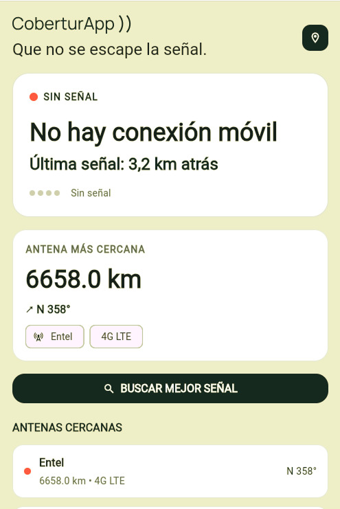
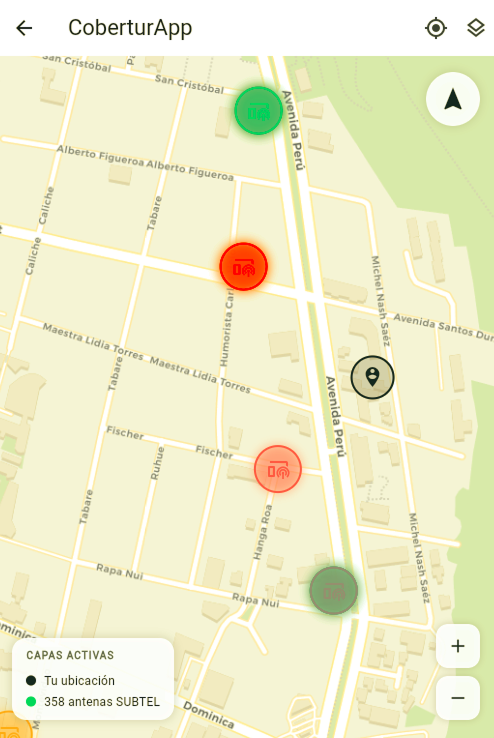
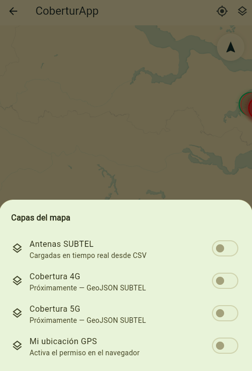

# CobertuApp

CobertuApp es una aplicación móvil desarrollada en Flutter para ayudar a los usuarios a consultar y entender la cobertura móvil en Chile. La interfaz inicial incluye un dashboard con estado de conexión, señal, antenas cercanas y una acción para buscar la mejor señal.

## Screenshots

<p align="center">



</p>

## Características

- Pantalla principal tipo dashboard para cobertura móvil
- Estado de conexión con información de operador y tecnología
- Indicador visual de calidad de señal
- Lista de antenas cercanas con distancia y dirección
- Diseño moderno con Material 3
- Estructura preparada para evolucionar hacia datos reales, GPS y mapas

## Tecnologías

- Flutter
- Dart
- Material 3
- GitHub para control de versiones

## Requisitos

- macOS 12 o superior
- Flutter 3.29.3 (incluye Dart 3.7.2; compatible con macOS 12)
- Un emulador o dispositivo físico

## Instalación

Este proyecto debe ejecutarse con Flutter 3.29.3. Las versiones actuales de
Flutter pueden requerir macOS 14 o superior y no funcionan en macOS 12.

### Instalación recomendada con FVM

```bash
git clone https://github.com/felipemvrin/cobertuapp.git
cd cobertuapp
brew install fvm
fvm install 3.29.3
fvm use 3.29.3
fvm flutter pub get
fvm flutter run
```

Para comprobar que se está usando la versión correcta:

```bash
fvm flutter --version
```

La salida debe indicar `Flutter 3.29.3` y `Dart 3.7.2`. A partir de entonces,
ejecuta los comandos de Flutter anteponiendo `fvm`, por ejemplo:

```bash
fvm flutter test
fvm flutter run -d chrome
```

Si FVM ya está instalado, comienza directamente desde `fvm install 3.29.3`.

## Estructura del proyecto

- lib/main.dart: punto de entrada de la app
- lib/presentation/: pantallas y widgets de la interfaz
- lib/domain/: modelos del dominio
- lib/data/: repositorios y fuentes de datos mock
- test/: pruebas de widget y flujo principal

## Estado actual

La app ya incluye una primera versión funcional de la pantalla principal con datos simulados para mostrar la experiencia de usuario y preparar la integración futura con información real de cobertura.

## Próximos pasos

- Integrar datos reales de cobertura
- Agregar mapa interactivo
- Incorporar ubicación GPS y orientación
- Mejorar la experiencia de búsqueda de mejor señal
